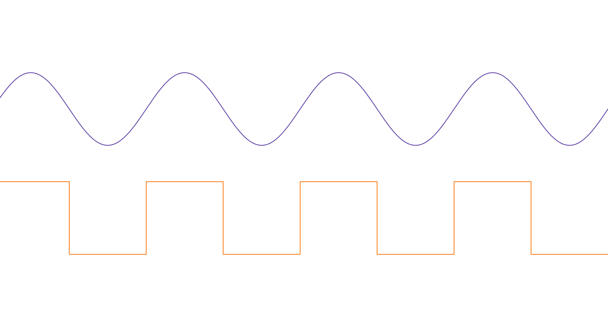

# Robotika[0]
## 2024

---

## Bemutatkozás
### Beni

- 11F
- diákkör vezető
- tavalyi robotika
- rust shill
- nixos user

---

## Bemutatkozás
### Kristóf

- 13F
- cybersec
- rust shill
- arch btw

--- 

## Mit fogunk megépíteni?
### Cél

- egy kétkerekű vonal- / falkövető robot
- könnyen összeszerelhető
- programozható
- vezeték nélküli

---

## Mit fogunk megépíteni?
### Megvalósítás

- egy kétkerekű vonal- / falkövető robot
  - fordulatszám, nyomaték, max sebesség
- könnyen összeszerelhető
  - 3D nyomtatott váz
    - több darabban
  - breadboard (próbapanel)
- programozható
  - mikrokontroller
- vezeték nélküli
  - akkumulátor
  - wifi

---

## Dev env

### `VSCode`

- kiegészíthető szövegszerkesztő

---

## Dev env

### `Python`

- egyszerű de nagyszerű 🐍 programozási nyelv

```bash
winget install python.python.3.13
```
vagy [python.org/downloads](https://www.python.org/downloads/)

---

## Dev env

### `MicroPython` type hints

- a VSCode tudjon segíteni

```bash
pip install -U micropython-rp2-pico_w-stubs --no-user --target ./typings
```

---

## Dev env

### `mpremote`

- kód feltöltése, debugolása

```bash
pip install --user mpremote --break-system-packages
```

---

## MicroPython firmware

- a MicroPython a tényleges program ami fut a roboton
  
```bash
pip install -U micropython-rp2-pico_w-stubs --no-user --target ./typings
```

---

## Hello World 👋

```python
print('Hello World')
```

---

## Mikrokontroller alapok

- pinek - input/output

```python
from time import sleep_ms
from machine import Pin

led = Pin("LED", Pin.OUT)

for i in range(10):
  print(i)
  led.toggle()
  sleep_ms(500)

print('done')

```

---

## Buzzer

- hang => frekvencia, hangerő
  - folytonos (vs mikrokontroller)

- folytonos jel "szimulálása"
  - ötlet: gyorsan ki be kapcsoljuk (**P**ulse **W**idth **M**odulation)
    - frekvencia: adódik
    - hangerő: mennyi ideig van bekapcsolva

---

## Buzzer



---

## Buzzer

```python
from machine import Pin, PWM
from time import sleep_ms

buzzer = PWM(Pin(0, Pin.OUT))
buzzer.duty_u16(0x7fff)

sleep_ms(2000)

buzzer.off()
```

---

### Rövid elektronikai kitérő

Ohm törvénye: $R = \frac{U}{I}$


> *https://www.build-electronic-circuits.com/ohms-law/*


---

## RGB led

- 3 szín => 3 PWM

```python
from machine import Pin, PWM
from time import sleep_ms

r, g, b = 0.5, 0.6, 0.7

pr = PWM(Pin(0, Pin.OUT))
pg = PWM(Pin(1, Pin.OUT))
pb = PWM(Pin(2, Pin.OUT))

pr.duty_u16(int(0xffff * r))
pg.duty_u16(int(0xffff * g))
pb.duty_u16(int(0xffff * b))
```

---

## Git

- verziókezelés

```bash
git init

git add ...
git commit

git remote set-url origin https://github.com/.../...

git push

```
